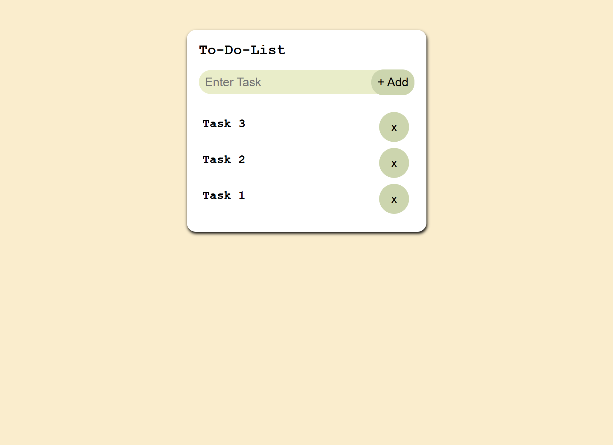

# 📝 To-Do List App


A simple and elegant **To-Do List Web App** built with **HTML**, **CSS**, and **JavaScript**.  
It allows users to **add**, **complete**, and **delete** tasks — all stored locally in your browser using **localStorage**.  
This ensures your tasks **stay saved even after refreshing or reopening** the browser tab.  

---

## ✨ Features

- ➕ Add new tasks  
- ✅ Mark tasks as completed (toggle line-through)  
- ❌ Delete tasks  
- 💾 Auto-save tasks using **localStorage**  
- 🔁 Auto-load saved tasks on page refresh  
- ⬆️ Newest task appears **on top** (`prepend()` used)  
- 🌐 100% Offline — No backend required  

---

## 🧩 Tech Stack

| Technology | Purpose |
|-------------|----------|
| **HTML5** | Structure & Markup |
| **CSS3** | Styling & Layout |
| **JavaScript (ES6)** | App Logic + localStorage |
| **localStorage API** | Data Persistence |

---

## 📂 Folder Structure
``` 
To-Do-List/
│
├── index.html # Main HTML file
├── style.css # Styling for layout & design
├── script.js # App logic (with localStorage)
```

---

## 🚀 Getting Started

### 1️⃣ Clone this repository
```bash
git clone https://github.com/Velang2003/To-Do-List.git
```

### 2️⃣ Open the project
```
cd To-Do-List
```

### 3️⃣ Run it locally

- Open index.html directly in your browser
- or use Live Server in Visual Studio Code

## 🧠 How It Works

- Type your task in the input field and click ➕ Add
- Click on a task to mark it as completed
- Click the ❌ icon to delete it
- Tasks are automatically saved and reloaded using localStorage
- New tasks appear at the top of the list

## 💾 localStorage Example
```
[
  { "text": "Buy groceries", "completed": false },
  { "text": "Finish assignment", "completed": true }
]
```

## 🖼️ Preview

<div align="center">
  
</div>

## 🧑‍💻 Author

### 👤 Velan
- 🎓 2nd Year BCA Student — Nrupathunga University
- 📧 velangabhay001@gmail.com

## 🪪 License

This project is open-source and free to use for learning and personal projects.
Feel free to fork, modify, and improve it! 🌱
